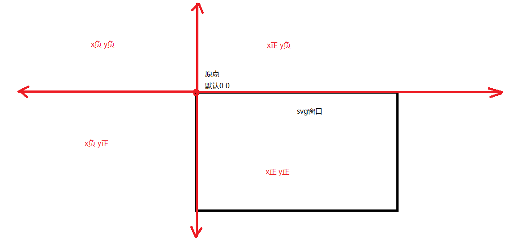

# 坐标系

## 概述

+ svg 如果不指定width与hight属性，则默认为 300px (高) * 150px (高)
+ width与hight属性可以设置相对单位，也可以使用绝对单位(像素)

  ```html
  <svg width="100%" height="100%">
  </svg>

  <!-- 绝对单位 -->
  <svg width="100" height="100">
  </svg>
  ```

+ 如果只想展示 svg 图像的一部分，就需要指定 wiewBox 属性

  ```html
  <svg viewBox="0 0 100 100" width="100%" height="400">
  </svg>
  ```

## 坐标系

+ 每一个svg标签，都会有一个自己的坐标系
+ 这个坐标系是隐式
+ 坐标系是无穷大的
+ 这个坐标系还有其他的象限部分，只不过默认窗口左上角为0 0点。 向右为x正，向下为y正

  

## 坐标系绘制

+ 绘制了 100 * 100 坐标系
+ 左上角原点（0,0） ， 向右为x正轴，向下为y正轴
+ 这个坐标系对我们接下来的图形绘制没有任何影响，只是方便观察

  

  ```html
  <svg xmlns="http://www.w3.org./2000/svg" viewBox="0 0 100 100" width="100" height="100" style="border: #aaa solid">
    <g>
      <path d="M0 10 H100 M0 20 H100 M0 30 H100 M0 40 H100 M0 50 H100 M0 60 H100 M0 70 H100 M0 80 H100 M0 90 H100 M0 100 H100
              M10 0 v100 M20 0 v100 M30 0 v100 M40 0 v100 M50 0 v100 M60 0 v100 M70 0 v100 M80 0 v100 M90 0 v100 M100 0 v100"
      stroke="#aaa" stroke-width=".2" fill="none" />
      <text x="0" y="3" font-size="3">0</text>
      <text x="8" y="3" font-size="3">10</text>
      <text x="18" y="3" font-size="3">20</text>
      <text x="28" y="3" font-size="3">30</text>
      <text x="38" y="3" font-size="3">40</text>
      <text x="48" y="3" font-size="3">50</text>
      <text x="58" y="3" font-size="3">60</text>
      <text x="68" y="3" font-size="3">70</text>
      <text x="78" y="3" font-size="3">80</text>
      <text x="88" y="3" font-size="3">90</text>
      <text y="11" x="0" font-size="3">10</text>
      <text y="21" x="0" font-size="3">20</text>
      <text y="31" x="0" font-size="3">30</text>
      <text y="41" x="0" font-size="3">40</text>
      <text y="51" x="0" font-size="3">50</text>
      <text y="61" x="0" font-size="3">60</text>
      <text y="71" x="0" font-size="3">70</text>
      <text y="81" x="0" font-size="3">80</text>
      <text y="91" x="0" font-size="3">90</text>
    </g>

  </svg>
  ```
