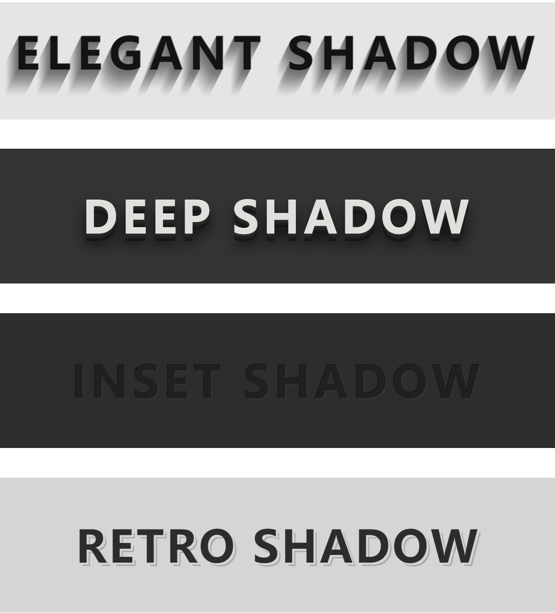

# 文字阴影 text-shadow

## 作用

+ 为文字添加阴影

  

## 缺点

+ 对性能有影响

+ 尽量少用

## 书写

+ `text-shadow: 水平偏移量 垂直偏移量 模糊程度 颜色;`

+ 每个阴影值由元素在X和Y方向的偏移量、模糊半径和颜色值组成

  ```css
  text-shadow: 1px 1px 2px pink;
  ```

  ```css
  /* offset-x | offset-y | blur-radius | color */
  text-shadow: 1px 1px 2px black;

  /* color | offset-x | offset-y | blur-radius */
  text-shadow: #fc0 1px 0 10px;

  /* offset-x | offset-y | color */
  text-shadow: 5px 5px #558abb;

  /* color | offset-x | offset-y */
  text-shadow: white 2px 5px;

  /* offset-x | offset-y
  /* Use defaults for color and blur-radius */
  text-shadow: 5px 10px;

  /* Global values */
  text-shadow: inherit;
  text-shadow: initial;
  text-shadow: unset;
  ```

## 注意

+ 模糊程度：不能为 负值，数字越大 越模糊
+ 但是细节会有问题，锯齿状

+ 可以使用下面的API

  + `-webkit-text-stroke`
  + `-webkit-text-fill-color`

## -webkit-text-stroke: 描边大小 描边颜色

+ 注意 text-stroke描边原理是居中描边，会影响字重

## -webkit-text-fill-color: 颜色；

+ 效果和color类似，会覆盖color效果
+ 可以保留color的继承特性，同时可以简化text-shadow属性

## 示例

+ code

  ```html
  <head>
    <style>
      h1 {
        font-size: 92px;
        padding: 80px 50px;
        text-align: center;
        text-transform: uppercase;
      }
      h1.elegantshadow {
        color: #131313;
        background-color: #e7e5e4;
        letter-spacing: 0.15em;
        text-shadow: 1px -1px 0 #767676, -1px 2px 1px #737272,
          -2px 4px 1px #767474, -3px 6px 1px #787777, -4px 8px 1px #7b7a7a,
          -5px 10px 1px #7f7d7d, -6px 12px 1px #828181, -7px 14px 1px #868585,
          -8px 16px 1px #8b8a89, -9px 18px 1px #8f8e8d, -10px 20px 1px #949392,
          -11px 22px 1px #999897, -12px 24px 1px #9e9c9c, -13px 26px 1px #a3a1a1,
          -14px 28px 1px #a8a6a6, -15px 30px 1px #adabab, -16px 32px 1px #b2b1b0,
          -17px 34px 1px #b7b6b5, -18px 36px 1px #bcbbba, -19px 38px 1px #c1bfbf,
          -20px 40px 1px #c6c4c4, -21px 42px 1px #cbc9c8, -22px 44px 1px #cfcdcd,
          -23px 46px 1px #d4d2d1, -24px 48px 1px #d8d6d5, -25px 50px 1px #dbdad9,
          -26px 52px 1px #dfdddc, -27px 54px 1px #e2e0df, -28px 56px 1px #e4e3e2;
      }
      h1.deepshadow {
        color: #e0dfdc;
        background-color: #333;
        letter-spacing: 0.1em;
        text-shadow: 0 -1px 0 #fff, 0 1px 0 #2e2e2e, 0 2px 0 #2c2c2c,
          0 3px 0 #2a2a2a, 0 4px 0 #282828, 0 5px 0 #262626, 0 6px 0 #242424,
          0 7px 0 #222, 0 8px 0 #202020, 0 9px 0 #1e1e1e, 0 10px 0 #1c1c1c,
          0 11px 0 #1a1a1a, 0 12px 0 #181818, 0 13px 0 #161616, 0 14px 0 #141414,
          0 15px 0 #121212, 0 22px 30px rgba(0, 0, 0, 0.9);
      }
      h1.insetshadow {
        color: #202020;
        background-color: #2d2d2d;
        letter-spacing: 0.1em;
        text-shadow: -1px -1px 1px #111, 2px 2px 1px #363636;
      }
      h1.retroshadow {
        color: #2c2c2c;
        background-color: #d5d5d5;
        letter-spacing: 0.05em;
        text-shadow: 4px 4px 0px #d5d5d5, 7px 7px 0px rgba(0, 0, 0, 0.2);
      }
    </style>
  </head>
  <body>
    <h1 class="elegantshadow">Elegant Shadow</h1>
    <h1 class="deepshadow">Deep Shadow</h1>
    <h1 class="insetshadow">Inset Shadow</h1>
    <h1 class="retroshadow">Retro Shadow</h1>
  </body>
  ```

