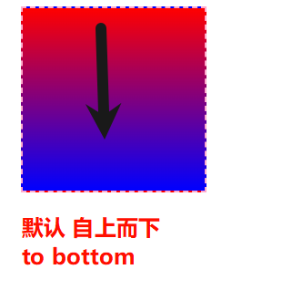
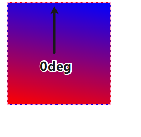
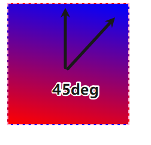
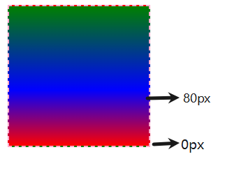
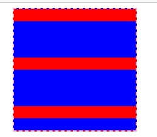
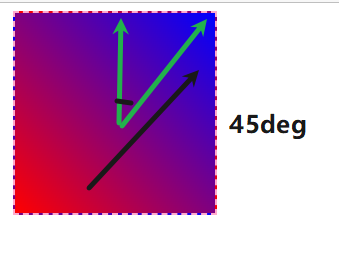
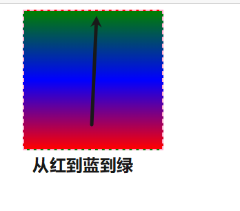
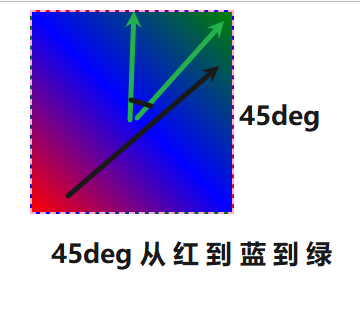

# 线性渐变 linear-gradient

## 语法

+ 语法1 `linear-gradient(渐变方向，颜色1 变化区间，颜色2 变化区间，。。。,颜色n 变化区间 )`

  + 渐变方向：

    + 关键字

      + to + 方向（ `top` , `bottom` , `right` , `left` ), t`o left` ,` to top`, `to top left`, `to left top`

    + 默认值：自上而下 `to bottom, 180deg`

      

    + `to top` 自下而上

  + 变化区间（渐变断点）：

    + 一个值: 作为颜色变化的边界
    + 两个值: 作为区间的开始以及终止

      ```css
      background-image: linear-gradient(0deg, red, blue, green)
      ```

  ```css
  /* 从右下到左上、从蓝色渐变到红色 */
  linear-gradient(to left top, blue, red);
  ```

+ 语法2 `linear-gradient(角度，颜色1 变化区间，颜色2 变化区间，。。。,颜色n 变化区间 )`

  ```css
  /* 渐变轴为 45 度，从蓝色渐变到红色 */
  background-image: linear-gradient(45deg, redk, blue);
  ```

  
  

+ 语法3 指定变化区间

  ```css
  background-image: linear-gradient(0deg, red 0px, blue 80px, green);
  ```

  

  ```css
  background-image: linear-gradient(0deg, red 0px 20px, blue 20px 80px, green);
  ```

  

  ```js
  background-image: linear-gradient(45deg, #fff 100px, skyblue 100px 200px, #fff 200px);
  ```

  

## repeating-linear-gradient()

+ 重复线性渐变：repeating-linear-gradient(); 注意：渐变区间的大小指的是在渐变方向的的小

  ```css
  background-image: repeating-linear-gradient(red 0px 20px, blue 20px 80px);
  ```

  

## 示例

+ 示例1 默认值 自上而下 `to bottom, 180deg`

  ```html
  <style>
    .box {
      width: 200px;
      height: 200px;
      border: 2px dashed #fac;
      margin: 0 auto;
      background-image: linear-gradient(red, blue);
      /*
      相当于
      background-image: linear-gradient(to bottom,red, blue);
      */
    }
  </style>

  <div class="box"></div>
  ```

  

+ 示例2 自下而上

  ```html
  <style>
    .box {
      width: 200px;
      height: 200px;
      border: 2px dashed #fac;
      margin: 0 auto;
      background-image: linear-gradient(to top,red, blue);
    }
  </style>

  <div class="box"></div>
  ```

  

+ 示例3 右下到左上

  ```html
  <style>
    .box {
      width: 200px;
      height: 200px;
      border: 2px dashed #fac;
      margin: 0 auto;
      background-image: linear-gradient(to top left, red, blue);
    }
  </style>

  <div class="box"></div>
  ```

  

## 示例之 角度

+ 示例1

  ```html
  <style>
    .box {
      width: 200px;
      height: 200px;
      border: 2px dashed #fac;
      margin: 0 auto;
      background-image: linear-gradient(45deg, red, blue);
    }
  </style>

  <div class="box"></div>
  ```

  

## 示例之 变化区间多个值

+ 示例1 0度

  ```html
  <style>
    .box {
      width: 200px;
      height: 200px;
      border: 2px dashed #fac;
      margin: 0 auto;
      background-image: linear-gradient(0deg, red, blue， green);
    }
  </style>

  <div class="box"></div>
  ```

  

+ 示例1 45度

  ```html
  <style>
    .box {
      width: 200px;
      height: 200px;
      border: 2px dashed #fac;
      margin: 0 auto;
      background-image: linear-gradient(0deg, red, blue， green);
    }
  </style>

  <div class="box"></div>
  ```

  
