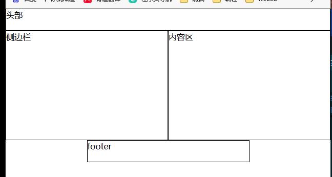

# grid-template-areas

## 概述

+ 给单元格命名

  + 单元格名称 汉字也可以
  + `·` 代表空的单元格

  ```css
  .ele {
    grid-template-areas:
    "头部 头部 头部 头部 头部"
    "侧边栏 侧边栏 内容区 内容区 内容区"
    ". footer footer footer ."
  }
  ```

+ 注意：每块区域保证是 **矩形** L型， 凹凸型都是无效区域

## 与 子项的grid-area配合

+ 配合着子项目中的 grid-area属性 使用

  ```css
  .ele {
    grid-template-areas:
      "头部 头部 头部 头部 头部"
      "侧边栏 侧边栏 内容区 内容区 内容区"
      ". footer footer footer ."
  }
  .header {
    grid-area: 头部
  }
  .sidebar {
    grid-area: 侧边栏
  }
  .content {
    grid-area: 内容区
  }
  .footer {
    grid-area: footer
  }
  ```

## 示例

+ 示例

  

  ```html
  <div class="grid-box">
    <div class="header">头部</div>
    <div class="sidebar">侧边栏</div>
    <div class="content">内容区</div>
    <div class="footer">footer</div>
  </div>
  ```

  ```css
  .grid-box {
    display: grid;
    height: 300px;
    grid-template-columns: repeat(4, 1fr);
    grid-template-rows: 1fr 5fr 1fr;
    grid-template-areas:
        "头部 头部 头部 头部"
        "侧边栏 侧边栏 内容区 内容区"
        ". footer footer ."
  }
  .grid-box div {
    border: 1px solid #000;
  }

  .header {
    grid-area: 头部;
  }
  .sidebar {
    grid-area: 侧边栏;
  }
  .content {
    grid-area: 内容区;
  }
  .footer {
    grid-area: footer;
  }
  ```

