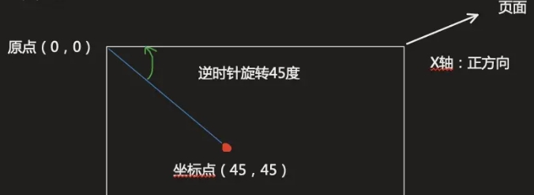
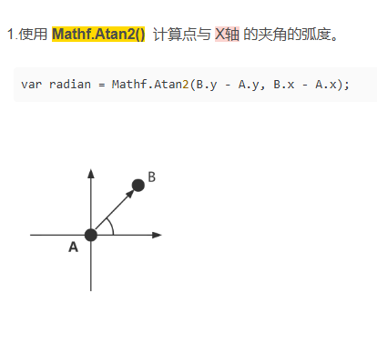

# 反三角函数

## 概述

+ 根据两条边求角度或弧度

## Math.asin()

+ `Math.asin(x)`

  + 参数

    + x 一个数值

  + 返回值 返回一个介于 -PI/2 到 PI/2 之间的弧度值

    + 如果接受的参数值超出范围，则返回 `NaN`

  

## Math.acos(x)

+ 返回一个数的反余弦值

  

## Math.atan(x)

+ `Math.atan(x)`

  + 参数

    + x 一个数值

  + 返回值 返回一个介于 -PI/2 到 PI/2 之间的弧度值

  

  ```js
  Math.atan(1); // 0.7853981633974483
  Math.atan(0); // 0
  ```

## Math.acosh(x)

+ 返回一个数的反双曲余弦值

## Math.asinh(x)

+ 返回一个数的反双曲正弦值

## Math.atanh(x)

+ 返回一个数的反双曲正切值

## Math.atan2(y, x)

+ `Math.atan2(y, x)`

  + 参数

    + y 一个数值
    + x 一个数值

  + 返回值 返回一个介于 -PI 到 PI 之间的弧度值

  

+ 注意

  + 返回逆时针角度，结果为 点 (x, y)与原点连线 和 正X轴 之间的夹角

  

  ```js
  Math.atan2(45,0)*180/Math.PI    //90
  Math.atan2(0,0)*180/Math.PI     // 0
  Math.atan2(0,45)*180/Math.PI     // 0
  Math.atan2(-180,180)*180/Math.PI  //-45
  ```

+ 计算任意两点间直线的倾斜角

  + 只需要将两点x,y坐标分别相减得到一个新的点(x2-x1,y2-y1).然后利用这个新点与原点坐标的连线求出角度就可以

