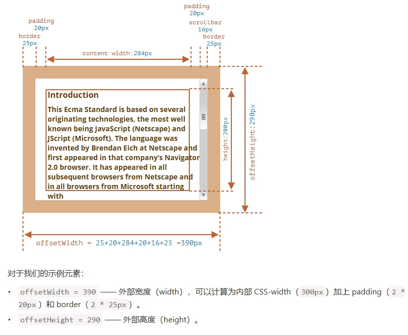

# offsetWidth/Height

## 概述

+ 提供了元素的“外部” `width` / `height`
+ 或者，换句话说，它的完整大小（包括边框）

  

## 对于未显示的元素，几何属性为 0/null

+ 仅针对显示的元素计算几何属性。

+ 如果一个元素（或其任何祖先）具有 `display:none` 或不在文档中，则所有几何属性均为零（或 `offsetParent` 为 `null` ）

+ 例如，当我们创建了一个元素，但尚未将其插入文档中，或者它（或它的祖先）具有 `display:none` 时， `offsetParent` 为 `null` ，并且 `offsetWidth` 和 `offsetHeight` 为 0

+ 我们可以用它来检查一个元素是否被隐藏，像这样

  ```js
  function isHidden(elem) {
    return !elem.offsetWidth && !elem.offsetHeight;
  }
  ```

+ 请注意，对于会展示在屏幕上，但大小为零的元素，它们的 `isHidden` 返回 `true`
