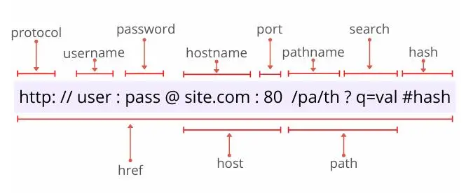

# URL 基础

## 概述

+ url 全称为 `Uniform Resource Locator`，统一资源定位符，是一个字符串，格式如下

  ```text
  protocol://hostname:port/path/?query#hash
  ```

  

+ `protocol`: 使用的协议，选择不同的协议会导致和服务器之间的信息交换格式、连接方式不同。大部分服务器支持 `http` 和 `https` 两种协议。如果选择了服务器不支持的协议，会导致访问失败

+ `hostname`：主机名，可以是 `ip`、域名
  + ip ：每台计算机在网络中唯一的编号，`127.0.0.1` 表示本机
  + 域名：网络中容易记忆的唯一单词，通过 DNS 服务器可以将域名解析成 IP，`localhost` 会被解析成 `127.0.0.1`

+ `port`：端口号，0~65535 之间的数字，相当于服务器计算机上的房号，使用不同的端口号相当于敲不同房间的门。计算机上的程序可以监听一个或多个端口号，如果访问的端口号有被程序监听，这计算机将会到达的网络访问交给对应的程序来处理
  + 端口号可以不写，使用默认值
    + http: 默认值 80
    + https: 默认值 443

+ `path`: 一个普通的字符串，该字符串会交给 web 服务器处理，主要用于定位服务
  + 如果 `path` 为 `/` ，则表示根路径，如 `http://www.baidu.com/` 的 `path` 就是 `/`

+ `query`: 一种特殊格式的字符串，该字符串会交给服务器处理，主要用于向服务器某个服务传递一些信息
  + 格式为： `属性名=属性值&属性名=属性值`

+ `hash`：一个普通的字符串，在浏览器地址栏中，如果 `url` 其他位置的信息保持不变，仅变动 `hash`，浏览器不会重新访问服务器，因此通常用于**不刷新**的页面内跳转

+ 可以看出

  + `protocol` : 用于告诉服务器使用那种协议进行传输数据
  + `hostname` : 用于精确定位计算机
  + `port` : 用于精确定位服务器
  + `path` : 用于精确定位服务器上的服务
  + `query` : 用于使用服务器的时候传递额外的信息，具体看服务器要求
  + `hash` : 一些额外的信息，服务器要不要用，具体看服务器要求

  ```text
  https://baike.baidu.com/item/HTML?a=1#1
  ```

## URL 注意点

+ url 仅支持 ASCII 字符，如果是包含非 ASCII 字符，会被浏览器自动进行编码

+ 例如

  ```text
  https://www.baidu.com/s?wd=王思聪
  ```

  ```text
  // 会被编码成
  https://www.baidu.com/s?wd=%E7%8E%8B%E6%80%9D%E8%81%AA
  ```


