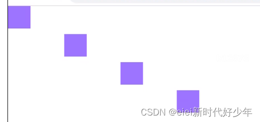

# 基础交错动画

## API

+ `anime.stagger(value, options)` 它针对多个元素

  + `anime.stagger(value, {start: startValue})`
  + `anime.stagger([startValue, endValue])`
  + `anime.stagger(value, {from: startingPosition})`
  + `anime.stagger(value, {direction: 'reverse'})`
  + `anime.stagger(value, {grid: [rows, columns]})`

  + value: 接收 `Number` , `String` , `Array`
  + options: 接收 `Objectt`

  ```js
  anime({
    targets: '.item',
    translateX: 270,
    delay: anime.stagger(1000) // 每个元素的延迟增加1000毫秒
  })
  ```

  
  

  ```js
  anime({
    targets: '.item',
    translateX: anime.stagger(100),
    delay: anime.stagger(100) // 每个元素的延迟增加100毫秒
  })
  ```

  
