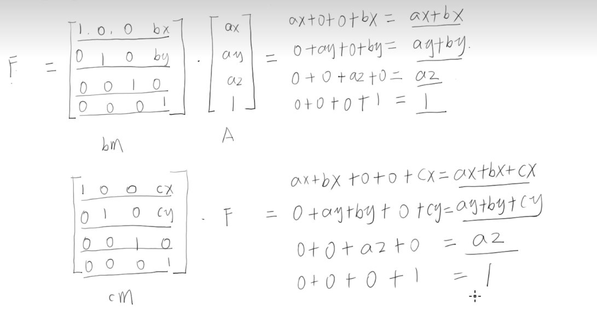

# 复合变换

## 示例1 位移两次

+ 想让一个物体位移两次

+ 已知

  + 初始点A(ax,ay,az, 1.0) `[ax,ay,az, 1.0]`
  + 第一次位移：沿x轴位移bx，沿y轴位移by
  + 第二次位移：沿x轴位移cx，沿y轴位移cy

+ 求：位移后的位置F(fx, fy, fz, fw)

  
  

+ 解

  + 步骤1: 设初次变换矩阵为bm（行主序）

    ```js
    // bm
    [
      1.0, 0.0, 0.0, bx,
      0.0, 1.0, 0.0, by,
      0.0, 0.0, 1.0, 0.0,
      0.0, 0.0, 0.0, 1.0,
    ]

    // 则第一次变换成的点f为
    f = bm * A
    fx = (1.0, 0.0, 0.0, bx) * (ax,ay,az, 1.0) = ax + bx
    fy = ( 0.0, 1.0, 0.0, by,) * (ax,ay,az, 1.0) = ay + by
    fz = (0.0, 0.0, 1.0, 0.0,) * (ax,ay,az, 1.0) = az
    fw = (0.0, 0.0, 0.0, 1.0,) * (ax,ay,az, 1.0) = 1.0
    ```

  + 步骤2:设第二次变换矩阵为cm(行主序)，则第二次变换后的点f为第二次变换矩阵乘以上一次变换后的点

    ```js
    // cm
    [
      1.0, 0.0, 0.0, cx,
      0.0, 1.0, 0.0, cy,
      0.0, 0.0, 1.0, 0.0,
      0.0, 0.0, 0.0, 1.0,
    ]

    // 则第一次变换成的点f为
    f = bm * A
    fx = (1.0, 0.0, 0.0, cx) * (fx,fy, fz, 1.0) = fz + cx
    fy = ( 0.0, 1.0, 0.0, cy,) * (fx,fy, fz, 1.0) = fy + cy
    fz = (0.0, 0.0, 1.0, 0.0,) * (fx,fy, fz, 1.0) = az
    fw = (0.0, 0.0, 0.0, 1.0,) * (fx,fy, fz, 1.0) = 1.0
    ```

  + 步骤3 通过两次的变换，最终的点F(cm * bm * A)

    ```js
    fx = ax + bx + cx
    fy = ay + by + cy
    fz = az
    fz = 1.0
    ```

+ code

  ```js
  // 第一次位移
  const [bx, by] = [0.4, 0.4];
  // 第二次位移
  const [cx, cy] = [0.3, 0.4];
  const bm = new Matrix4().set(
    1.0, 0, 0, bx,
    0, 1, 0, by,
    0, 0, 1, 0,
    0, 0, 1, 1,
  );

  const cm = new Matrix4().set(
    1.0, 0, 0, cx,
    0, 1, 0, cy,
    0, 0, 1, 0,
    0, 0, 1, 1,
  );

  const dm = cm.multiply(bm);
  gl.uniformMatrix4fv(u_Matrix, false, dm.elements);
  ```

## 示例2 先移动后旋转

+ code

  ```js
  const mr=new Matrix4()
  mr.makeRotationZ(Math.PI/4)

  const mt=new Matrix4()
  mt.makeTranslation(0.3,0,0)

  const matrix=mr.multiply(mt)
  const u_Matrix=gl.getUniformLocation(gl.program,'u_Matrix')
  gl.uniformMatrix4fv(u_Matrix,false,matrix.elements)
  ```

+ mr 是旋转矩阵

+ mt 是位移矩阵

+ `mr.multiply(mt)` 便是先位移再旋转

  

## 先旋转后移动

+ code

  ```js
  const mr=new Matrix4()
  mr.makeRotationZ(Math.PI/4)

  const mt=new Matrix4()
  mt.makeTranslation(0.3,0,0)

  const matrix=mt.multiply(mr)
  const u_Matrix=gl.getUniformLocation(gl.program,'u_Matrix')
  gl.uniformMatrix4fv(u_Matrix,false,matrix.elements)
  ```

  

## 先旋转后缩放

+ `makeScale()` 是矩阵的缩放方法

  ```js
  const mr=new Matrix4()
  mr.makeRotationZ(Math.PI/4)

  const ms=new Matrix4()
  ms.makeScale(2,0.5,1)

  const matrix=ms.multiply(mr)
  const u_Matrix=gl.getUniformLocation(gl.program,'u_Matrix')
  gl.uniformMatrix4fv(u_Matrix,false,matrix.elements)
  ```

## 综合变换

+ Matrix4还有一个compose综合变换方法，它可以将所有变换信息都写进去，其变换顺序就是先缩放，再旋转，最后位移

  ```js
  const matrix=new Matrix4()
  const pos=new Vector3(0.3,0,0)
  const rot=new Quaternion()
  rot.setFromAxisAngle( new Vector3( 0, 0, 1 ), Math.PI / 4 )
  const scale=new Vector3(2,0.5,1)
  matrix.compose(pos,rot,scale)
  const u_Matrix=gl.getUniformLocation(gl.program,'u_Matrix')
  gl.uniformMatrix4fv(u_Matrix,false,matrix.elements)
  ```

+ compose ( position : Vector3, quaternion : Quaternion, scale : Vector3 )

  + position 位置
  + quaternion 用四元数存储的旋转数据
  + scale 缩放

+ compose() 方法分解开来，就是这样的

  ```js
  const mt=new Matrix4()
  mt.makeTranslation(0.3,0,0)

  const mr=new Matrix4()
  mr.makeRotationZ(Math.PI/4)

  const ms=new Matrix4()
  ms.makeScale(2,0.5,1)

  const matrix=mt.multiply(mr).multiply(ms)
  const u_Matrix=gl.getUniformLocation(gl.program,'u_Matrix')
  gl.uniformMatrix4fv(u_Matrix,false,matrix.elements)
  ```
