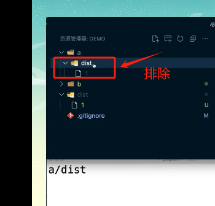
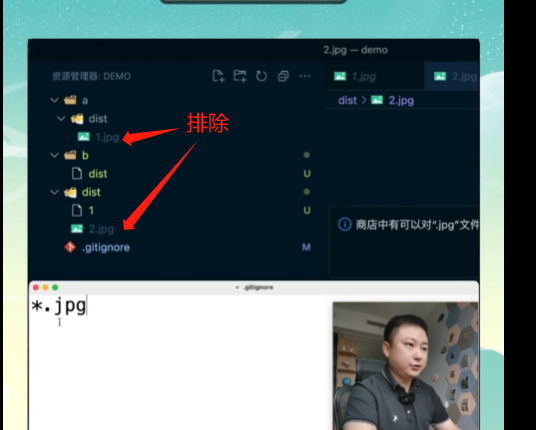
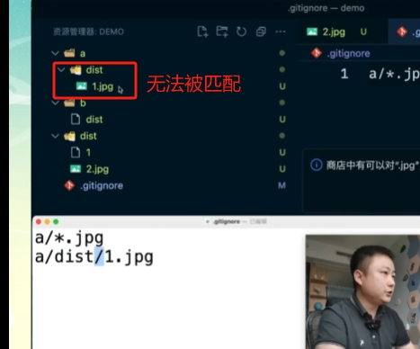
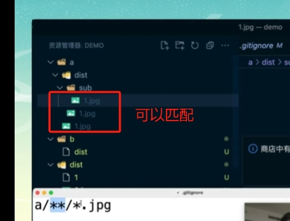
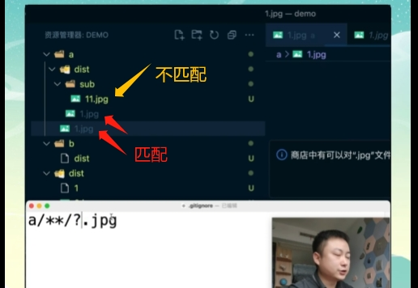

# 忽略文件配置

## .gitignore

1、配置语法:

> 以斜杠“/”开头表示目录；
>
> 以星号“*”通配多个字符；
>
> 以问号“?”通配单个字符
>
> 以方括号“[]”包含单个字符的匹配列表；
>
> 以叹号“!”表示不忽略(跟踪)匹配到的文件或目录；

此外，git 对于 .ignore 配置文件是按行从上到下进行规则匹配的，意味着如果前面的规则匹配的范围更大，则后面的规则将不会生效；

2、示例：

　　（1）规则：fd1/*
　　　　  说明：忽略目录 fd1 下的全部内容；注意，不管是根目录下的 /fd1/ 目录，还是某个子目录 /child/fd1/ 目录，都会被忽略；

　　（2）规则：/fd1/*
　　　　  说明：忽略根目录下的 /fd1/ 目录的全部内容；

　　（3）规则：

/*
!.gitignore
!/fw/bin/
!/fw/sf/

说明：忽略全部内容，但是不忽略 .gitignore 文件、根目录下的 /fw/bin/ 和 /fw/sf/ 目录；

## 直接书写单词

+ 直接书写单词

  ```
  // .gitignore
  dist

  // 匹配整个工程中，排除所有名称为dist的目录或者文件
  ```

  

## 带 /

+ 情况1 `/dist` 以 `.gitignore` 文件所在的目录为基准，排除 文件或目录

  
  

+ 情况2 `a/dist` 以 `.gitignore` 文件所在的目录为基准，排除 a 目录下的 dist 的文件或者 目录

  

+ 情况3 `dist/` 整个项目的 dist 文件夹都会被排除

  

+ 情况4 `/asd/`

## 带 *

+ 匹配任意字符(0个或多个字符)， `/` 除外

+ 情况1：`*.jpg` 整个工程文件(不管文件位置在什么地方)以 `.jpg` 结尾的文件都被排除

  

+ 情况2 `a/*.jpg` 匹配 `.gitignore` 同级 a文件夹下的子文件以 `.jpg` 为后缀的文件

  ```js
  // 符合匹配要求
  a/1.jpg

  // 不符合匹配要求
  a/dist/1.jpg
  ```

  

+ 情况3 `a/**/*.jpg` 匹配 `.gitignore` 同级 a文件夹下所有以 `.jpg` 为后缀的文件

  ```js
  // 符合匹配要求
  a/1.jpg

  // 符合匹配要求
  a/dist/1.jpg
  a/dist/a/1.jpg
  ```

  

+ 情况4 `a/**/*.*` 匹配 `.gitignore` 同级 a文件夹下所有的文件

## ?

+ 匹配1个字符

+ 情况1 `a/**/?.jpg` 匹配 `.gitignore` 同级 a文件夹下所有以 `.jpg` 为后缀的文件同时文件名只有1个字符

  ```js
  // 符合匹配要求
  a/1.jpg
  a/b/1.jpg

  // 不符合匹配要求
  a/11.jpg
  ```

  

+ 情况2 `a/**/??.jpg` 匹配 `.gitignore` 同级 a文件夹下所有以 `.jpg` 为后缀的文件同时文件名只有2个字符

  ```js
  // 符合匹配要求
  a/11.jpg
  a/b/22.jpg

  // b不符合匹配要求
  a/1.jpg
  a/b/1.jpg
  ```

## !


