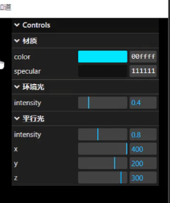
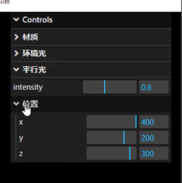

# 添加分组 addFolder

## 概述

+ 当GUI交互界面需要控制的属性比较多的时候，为了避免混合，可以适当分组管理，这样更清晰

  

+ `new GUI()` 实例化一个gui对象，默认创建一个总的菜单，通过gui对象的 `.addFolder()` 方法可以创建一个子菜单
+ 当你通过GUI控制的属性比较多的时候，可以使用 `.addFolder()` 进行分组

  ```js
  const gui = new GUI();//创建GUI对象

  const folder1 = gui.addFolder( '分组1' );
  const folder2 = gui.addFolder( '分组2' );
  const folder3 = gui.addFolder( '分组3' );
  ```

+ `.addFolder()` 返回的子文件夹对象，同样具有gui对象的`.add()`、 `.onChange()`、 `.addColor()` 等等属性

  ```js
  const gui = new GUI();//创建GUI对象

  const folder1 = gui.addFolder( '分组1' );
  folder1.close();

  // 分组1添加内容
  folder1.add('', '')
  ```

## .addFolder()套娃——子菜单嵌套子菜单

+ `.addFolder()` 创建的对象，同样也具有 `.addFolder()` 属性，可以继续嵌套子菜单

  

  ```js
  // 平行光子菜单
  const dirFolder = gui.addFolder('平行光');
  dirFolder.close();//关闭菜单

  // 平行光强度
  dirFolder.add(directionalLight, 'intensity',0,2);
  const dirFolder2 = dirFolder.addFolder('位置');//子菜单的子菜单
  dirFolder2.close();//关闭菜单

  // 平行光位置
  dirFolder2.add(directionalLight.position, 'x',-400,400);
  dirFolder2.add(directionalLight.position, 'y',-400,400);
  dirFolder2.add(directionalLight.position, 'z',-400,400);
  ```
