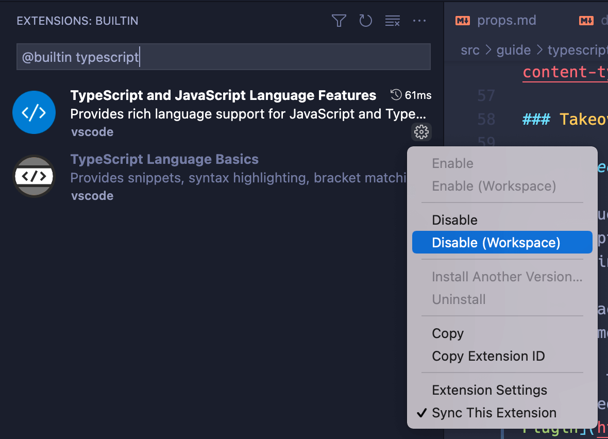

# 托管模式

## 前提

+ 仅针对 VSCode + Volar

## 概述

+ 为了让 Vue 单文件组件和 TypeScript 一起工作，Volar 创建了一个针对 Vue 的 TS 语言服务实例，将其用于 Vue 单文件组件。同时，普通的 TS 文件依然由 VSCode 内置的 TS 语言服务来处理。这也是为什么我们需要安装 [TypeScript Vue Plugin](https://marketplace.visualstudio.com/items?itemName=Vue.vscode-typescript-vue-plugin "TypeScript Vue Plugin") 来支持在 TS 文件中引入 Vue 单文件组件。这套默认设置能够工作，但在每个项目里我们都运行了两个语言服务实例：一个来自 Volar，一个来自 VSCode 的内置服务。这在大型项目里可能会带来一些性能问题

+ 为了优化性能，Volar 提供了一个叫做“托管模式”的功能。在托管模式下，Volar 使用单个 TS 语言服务实例同时为 Vue 和 TS 文件提供支持

+ 开启托管模式，你需要执行以下步骤来**在你的项目的工作空间中**禁用 VSCode 的内置 TS 语言服务：

    1. 在当前项目的工作空间下，用 `Ctrl + Shift + P` (macOS：`Cmd + Shift + P`) 唤起命令面板

    2. 输入 `built`，然后选择“Extensions：Show Built-in Extensions”

    3. 在插件搜索框内输入 `typescript` (不要删除 `@builtin` 前缀)

    4. 点击“TypeScript and JavaScript Language Features”右下角的小齿轮，然后选择“Disable (Workspace)”

    5. 重新加载工作空间。托管模式将会在你打开一个 Vue 或者 TS 文件时自动启用

        
