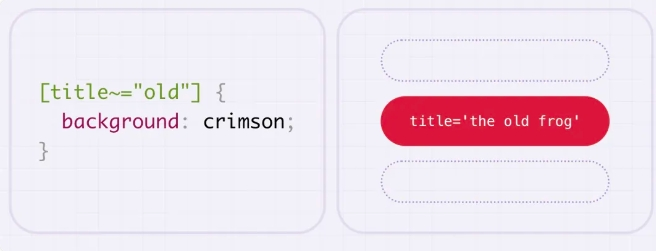
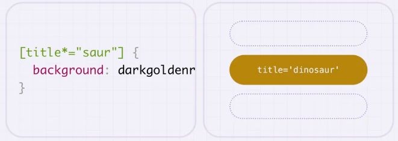

# 属性选择器

## 概述

+ 属性选择器用于选择具有特定属性的元素

## attribute

+ 使用 `[attribute]` 来选择所有具有 `attribute` 属性的元素

  ```css
  [data-text] {
    background: coral;
  }
  ```

  

## attribute=value

+ 使用 `[attribute=value]` 来选择具有指定属性及属性值的元素：

  ```css
  [data-text="hello"] {
    background: coral;
  }
  ```

  

## attribute~=value

+ 使用 `[attribute~=value]` 来选择具有指定属性，并且该属性的多个值中包含给定值的元素

  ```css
  [data-text="old"] {
    background: coral;
  }
  ```

  

## attribute*=value

+ 使用 `[attribute*=value]` 来选择具有指定属性，并且该属性的值中包含特定部分值的元素

  ```css
  [text*="saur"] {
    background: coral;
  }
  ```

  

## attribute^=value

+ 使用 `[attribute^=value]` 来选择具有指定属性，并且该属性的值以给定值开头的元素

  ```css
  a[href^='http'] {
    background: Aquamarine;
  }

  a[href^='#'] {
    background: AntiquerWhite;
  }

  a[href^='/'] {
    background: LavenderBlue;
  }
  ```

  

## attribute$=value

+ 使用 `[attribute$=value]` 来选择具有指定属性，并且该属性的值以给定值结尾的元素

