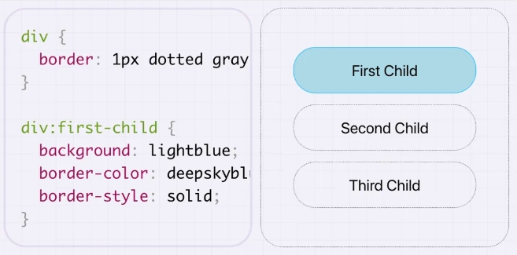
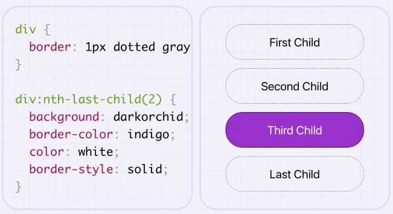
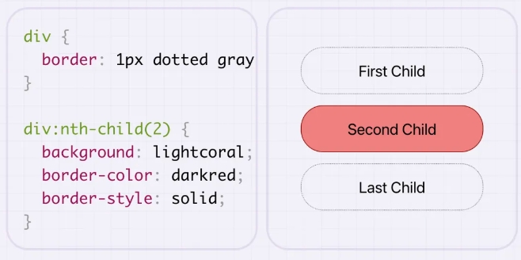

# 同级别，不区分类型

## 类型

+ `:first-child` 伪类用于选择父元素中的第一个子元素

  

+ `:last-child` 用于选择父元素中的最后一个子元素

  

+ `:nth-child(n)` 第 n 个子元素

+ `:nth-last-child(n)` 倒数第 n 个子元素

  

## :nth-child

+ :nth-child 伪类根据元素在父元素中的位置进行选择，允许进行各种选择。:nth-child 还可以自定义模式选择元素：

  + `:nth-child(odd)` 或 `:nth-child(2n+1)` 选择每个奇数位置的子元素

  + `:nth-child(even)` 或 `:nth-child(2n)` 选择每个偶数位置的子元素

  

+ 公式中的 n 就像一个计数器，可以按重复周期选择元素
+ 例如，:nth-child(3n) 将选择每三个元素

  ```css
  /* 奇数行 */
  tbody tr:nth-child(odd) {
    background-color: #ddd;
  }

  /* 偶数行 */
  tbody tr:nth-child(even) {
    background-color: #ddd;
  }

  /* 指定间隔规则 */
  li:nth-child(3n + 1) { /* 第一个元素开始，每隔每三个元素选一个： */

    background-color: rebeccapurple;
  }
  ```
