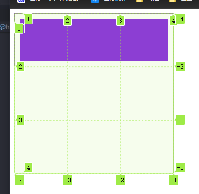

# 栅格编号放置位置

## 示例

+ 示例1

  ```html
  <article>
    <div>1</div>
  </article>
  ```

  ```css
  article {
    width: 300px;
    height: 300px;
    border: 1px solid silver;
    display: grid;

    /* 行高 最大100px 最小50px */
    grid-template-rows: repeat(3, 1fr);
    grid-template-columns: repeat(3, 1fr);
  }
  div {
    background-color: blueviolet;
    background-clip: content-box;
    border: 1px solid blueviolet;
    padding: 10px;
    box-sizing: border-box;
    color: white;
    font-size: 25px;
  }

  div:first-child {
    grid-row-start: 1; /* 行开始 */
    grid-row-end: 2; /* 行结束 */
    grid-column-start: 1; /* 列开始 */
    grid-column-end:4; /* 列结束 */
  }
  ```

  

+ 示例2

  ```html
  <article>
    <div>1</div>
  </article>
  ```

  ```css
  article {
    width: 300px;
    height: 300px;
    border: 1px solid silver;
    display: grid;

    /* 行高 最大100px 最小50px */
    grid-template-rows: repeat(3, 1fr);
    grid-template-columns: repeat(3, 1fr);
  }
  div {
    background-color: blueviolet;
    background-clip: content-box;
    border: 1px solid blueviolet;
    padding: 10px;
    box-sizing: border-box;
    color: white;
    font-size: 25px;
  }

  div:first-child {
    grid-row-start: 2;
    grid-row-end: 3;
    grid-column-start: 1;
    grid-column-end: 2;
  }
  ```

  

+ 示例3

  ```html
  <article>
    <div>1</div>
    <div>2</div>
    <div>3</div>
  </article>
  ```

  ```css
  article {
    width: 300px;
    height: 300px;
    border: 1px solid silver;
    display: grid;

    /* 行高 最大100px 最小50px */
    grid-template-rows: repeat(2, 1fr);
    grid-template-columns: repeat(2, 1fr);
  }
  div {
    background-color: blueviolet;
    background-clip: content-box;
    border: 1px solid blueviolet;
    padding: 10px;
    box-sizing: border-box;
    color: white;
    font-size: 25px;
    /* margin: 10px; */
  }

  div:first-child {

    grid-row-start: 1; /* 行开始 */
    grid-row-end: 3; /* 行结束 */
    grid-column-start: 1; /* 列开始 */
    grid-column-end: 2; /* 列结束 */
  }

  div:nth-child(2) {
    grid-row-start: 1; /* 行开始 */
    grid-row-end: 2; /* 行结束 */
    grid-column-start: 2; /* 列开始 */
    grid-column-end: 3; /* 列结束 */
  }

  div:nth-child(3) {
    grid-row-start: 2; /* 行开始 */
    grid-row-end: 3; /* 行结束 */
    grid-column-start: 2; /* 列开始 */
    grid-column-end: 3; /* 列结束 */
  }
  ```

  

## 简写

+ `grid-row` 属性是 `grid-row-start` 属性和 `grid-row-end` 的合并简写形式
+ `grid-column` 属性是 `grid-column-start` 和 `grid-column-end` 的合并简写形式
+

  ```css
  .item {
    grid-column: <start-line> / <end-line>;
    grid-row: <start-line> / <end-line>;
  }
  ```

  ```css
  .item-1 {
    grid-column: 1 / 3;
    grid-row: 1 / 2;
  }
  /* 等同于 */
  .item-1 {
    grid-column-start: 1;
    grid-column-end: 3;
    grid-row-start: 1;
    grid-row-end: 2;
  }
  ```
