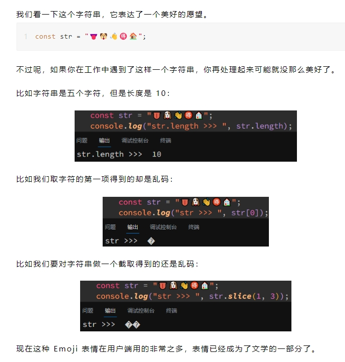
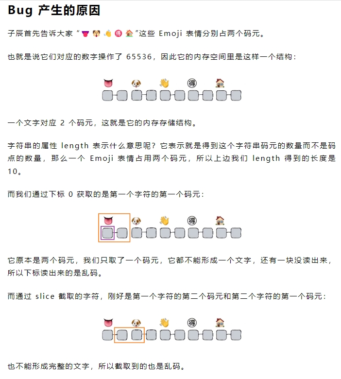

# 按照码点来截取

## 概述

+ Emoji 表情

  ```js
  // 长度
  const str = "👅🐶👋🉐🏠";
  str.length; // 10
  ```

+ 取字符的第一项乱码

  ```js
  const str = "👅🐶👋🉐🏠";
  str[0] // '\uD83D'
  ```

+ 截取乱码

  ```js
  const str = "👅🐶👋🉐🏠";
  str.slice(1,3); // '\uDC45\uD83D'
  ```

  
  

## 解决

+ pointLength: 用于获取码点的长度，也就是字符串实际看到的长度

  ```js
  const str0 = "👅🐶👋🉐🏠";
  const str1 = "👅🐶a👋🉐🏠";
  String.prototype.pointLength = function () {
    // 声明一个变量用于记录长度
    let len = 0;
    for (let i = 0; i < this.length; ) {
      // 通过 codePointAt 的到码元数
      const codePoint = this.codePointAt(i);
      // 我们利用三目运算符来对 i 进行控制
      i += codePoint > 65536 ? 2 : 1;
      // 每一次都记录一下长度
      len++;
    }
    return len;
  };
  console.log('pointLength >>> ', str0.pointLength()) // 5
  console.log('pointLength >>> ', str1.pointLength()) // 6
  ```

+ pointAt: 用来获取字符串某一个位置的字符

  ```js
  // index 字符串的下标
  // 返回当前下标的字符
  String.prototype.pointAt = function (index) {
    let curIndex = 0; // 码点的下标
    for (let i = 0; i < this.length; ) {
      const codePoint = this.codePointAt(i);
      // 如果当前码点的下标与传入的下标值一致就返回当前的码点值
      if (curIndex === index) {
        // 这里我们通过 fromCodePoint 方法将码元值转换成字符
        return String.fromCodePoint(codePoint);
      }
      // 如果没有找到对应的值继续遍历
      i += codePoint > 65536 ? 2 : 1;
      curIndex++;
    }
  };

  const str0 = "👅🐶👋🉐🏠";
  const str1 = "👅🐶a👋🉐🏠";
  console.log('pointAt >>> ', str0.pointAt(2)) // 👋
  console.log('pointAt >>> ', str1.pointAt(2)) // a
  ```

+ sliceByPoint: 字符串截取

  ```js
  // 起始的值默认为 0
  // 结束的位置默认为码点的长度，也就是 pointLength 函数的值
  String.prototype.sliceByPoint = function (start = 0, end = this.pointLength()) {
    let result = "";
    for (let i = start; i < end; i++) {
      result += this.pointAt(i);
    }
    return result;
  };

  const str0 = "👅🐶👋🉐🏠";
  const str1 = "👅🐶a👋🉐🏠";
  console.log('sliceByPoint >>> ', str0.sliceByPoint(0,3)) // 👅🐶👋
  console.log('sliceByPoint >>> ', str1.sliceByPoint(0,3)) // 👅🐶a
  ```
