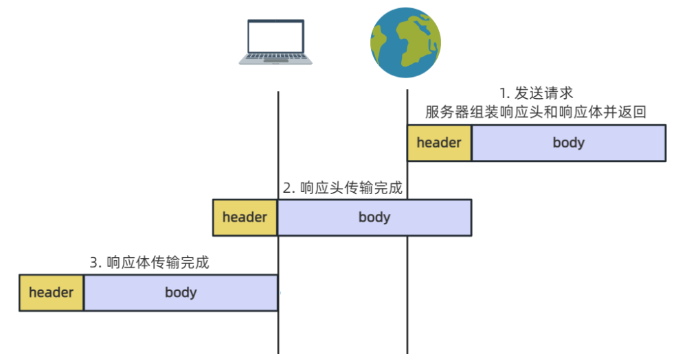
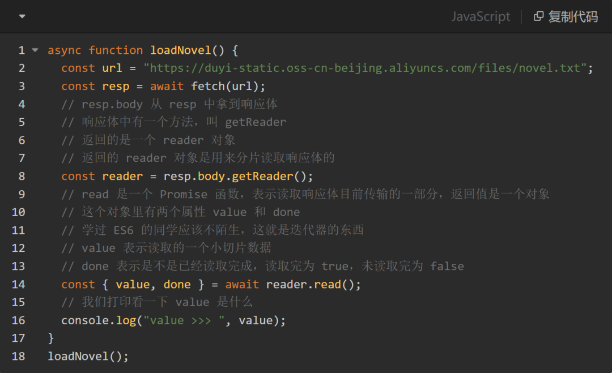

# 数据流式获取

## 解决的问题

+ 处理较大的网络请求时，我们往往会面临着长时间的等待和页面白屏的问题
+ 这不仅影响了用户体验，也降低了网站的性能
+ 分片接收网络数据：

  + 可以让我们在网络请求时不必等待整个响应体传输完成，而是分片地接收和显示数据
  + 可以大大缩短等待时间，避免页面白屏的出现，提高用户体验

## 实现方式

  + 利用fetch API 和TextDecoder解码器来实现分片接收网络数据，并将数据分片显示在页面上

## 未使用

+ 测试示例

  ```js
  async function loadNovel() {
    const url = "xxx";
    const resp = await fetch(url); // 响应头传输完成
    const text = await resp.text(); // 响应体的传输完成(如果如果量过大，会在此处等待时间过久)
  }
  loadNovel();
  ```

  

+ 解决办法：在响应体传输过程中就开始接收和显示数据

## 分片加载

+ 在响应体传输过程中接收和显示数据是完全可行的，因为响应体是一点一点传输过来的，并不是一次性发送完毕
+ 如果我们可以分片地接收它传过来的数据，并及时地显示在页面上，那就可以让用户感觉到网站很快速地响应了他们的请求

  + 可以利用fetch API 中的 `getReader` 来分片读取

  

+ 首先我们知道resp 对象中有一个body，它代表的是响应体，只不过这个响应体 `body` 还未完成

  + body的类型是一个可读流，可以利用 body 里的一个属性 `body.getReader` 拿到这个流的读取器
  + 读取器中有一个 `read` 属性，可以读取到数据

  
  

  + 打印出来可以看到，虽然我们读取的是文本，但是结果并不是一个字符串。

  + 这是因为 `reader.read()` 函数是一个通用型函数，它也不知道服务器响应给你的是什么数据，因此它把数据统一成一个字节数组，字节数组由一个字节组成

  + 而我们现在读取的是文本，所以我们要把字节数组转化为文本，这里就要使用到一个非常有用的属性了，叫做文本解码器 `TextDecoder`


## 使用

+ code

  ```js
  async function getResponse() {
    const url = "xxxx";
    const resp = await fetch(url);

    // 常规使用
    // const msg = await resp.text();

    // 数据流式获取
    const reader = resp.body.getReader();
    const decoder = new TextDecoder(); // 创建一个解码器
    let remainChunk = new Uint8Array(0);

    for(;;) {
      // done 是否读取完成,如果返回true则表示读取结束
      // value 返回值（类型化数组）
      const { value, done } = await reader.read();

      if(done) {
        break;
      }

      const lastIndex = value.lastIndexOf(10);
      const chunk = value.slice(0, lastIndex + 1);
      const readChunk = new Uint8Array(remainChunk.length + chunk.length);
      readChunk.set(remainChunk);
      readChunk.st(chunk, remainChunk.length);

      remainChunk = value.slice(lastIndex + 1);
      const text = decoder.decode(readChunk);
      console.log(text);
    }

    const text = decoder.decode(remainChunk);
    console.log(text);
  }
  ```
