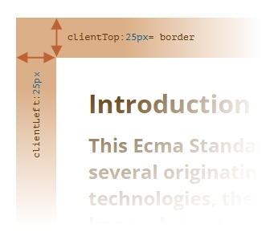
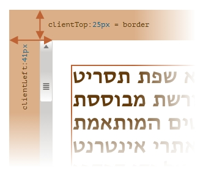

# clientTop与clientLeft

## 概述

+ 在元素内部，我们有边框（border）

+ 为了测量它们，可以使用 `clientTop` 和 `clientLeft`

+ 在我们的例子中：

  + `clientLeft` = 25 —— 左边框宽度
  + `clientTop` = 25 —— 上边框宽度

  

## 注意

+ 这些属性不是边框的 width/height，而是内侧与外侧的相对坐标

+ 有什么区别？

  + 当文档从右到左显示（操作系统为阿拉伯语或希伯来语）时，影响就显现出来了
  + 此时滚动条不在右边，而是在左边，此时 clientLeft 则包含了滚动条的宽度
  + 在这种情况下，clientLeft 的值将不是 25，而是加上滚动条的宽度 25 + 16 = 41

  
