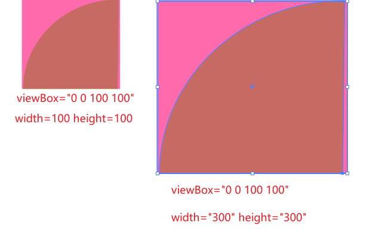

# 坐标系、窗口区域、视口区域

## 坐标系绘制

+ 绘制了 100 * 100 坐标系
+ 左上角原点（0,0） ， 向右为x正轴，向下为y正轴
+ 这个坐标系对我们接下来的图形绘制没有任何影响，只是方便观察

  

  ```html
  <svg xmlns="http://www.w3.org./2000/svg" viewBox="0 0 100 100" width="400" height="400" style="border: #aaa solid">
    <g>
      <path d="M0 10 H100 M0 20 H100 M0 30 H100 M0 40 H100 M0 50 H100 M0 60 H100 M0 70 H100 M0 80 H100 M0 90 H100 M0 100 H100
              M10 0 v100 M20 0 v100 M30 0 v100 M40 0 v100 M50 0 v100 M60 0 v100 M70 0 v100 M80 0 v100 M90 0 v100 M100 0 v100"
      stroke="#aaa" stroke-width=".2" fill="none" />
      <text x="0" y="3" font-size="3">0</text>
      <text x="8" y="3" font-size="3">10</text>
      <text x="18" y="3" font-size="3">20</text>
      <text x="28" y="3" font-size="3">30</text>
      <text x="38" y="3" font-size="3">40</text>
      <text x="48" y="3" font-size="3">50</text>
      <text x="58" y="3" font-size="3">60</text>
      <text x="68" y="3" font-size="3">70</text>
      <text x="78" y="3" font-size="3">80</text>
      <text x="88" y="3" font-size="3">90</text>
      <text y="11" x="0" font-size="3">10</text>
      <text y="21" x="0" font-size="3">20</text>
      <text y="31" x="0" font-size="3">30</text>
      <text y="41" x="0" font-size="3">40</text>
      <text y="51" x="0" font-size="3">50</text>
      <text y="61" x="0" font-size="3">60</text>
      <text y="71" x="0" font-size="3">70</text>
      <text y="81" x="0" font-size="3">80</text>
      <text y="91" x="0" font-size="3">90</text>
    </g>

  </svg>
  ```

## svg根元素

+ 位置1：写在 `.svg` 文件中，作为根标记，要求有且只有一个

+ 位置2：写在 `.html` 文件中，可以写多个标记，表示嵌入了多个svg图片， 每一个svg都是一个独立的区域

## 坐标系

+ svg中每一个图形的绘制都会基于一个坐标系（系统），*隐式*（不可见）
+ 这是真正的坐标系，上面绘制的坐标系只是基于真实坐标系形成的图形，方便理解

## viewBox属性

+ 视图窗口，装载绘制的图形
+ 可以装载整个图形，也可以装载部分图形
+ 通过 `x` `y` `width` `height` 四个属性值来控制

  + `width` 和 `height` 用来设置窗口的宽高
  + `x` 和 `y` 设置窗口起始的位置
  + 如果x和y为负， 最终的装载的结果相当于图形向右向下

  ```html
  <svg viewBox="0 0 100 100"></svg>
  ```

  

### viewBox的width和height属性

+ 设置视口区域的大小，设置可视区域的大小

+ `viewbox` 窗口装载完的图形，需要在视口展示

+ 在没有设置 `viewbox` 的情况下， `viewbox` 装载的区域和视口区域相同

+ 如果设置了 `viewBox` ，且装载区域的大小与可视区域的大小不同，此时就会按照比例，对装载区域图形放大或缩小展示

+ 可以合理的利用 `viewBox` 和 `width` 与 `height` 实现图形的放缩

+ 示例

  + 通过坐标系，绘制了（100,100） r=100
  + 设置窗口装载100,100范围，装载了1/4的圆，也就是左上角的圆
  + 将窗口中这1/4个圆，放到400*400范围的视口中展示，最终这1/4圆会放大4倍展示

  
