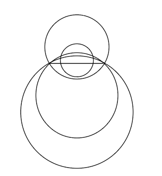
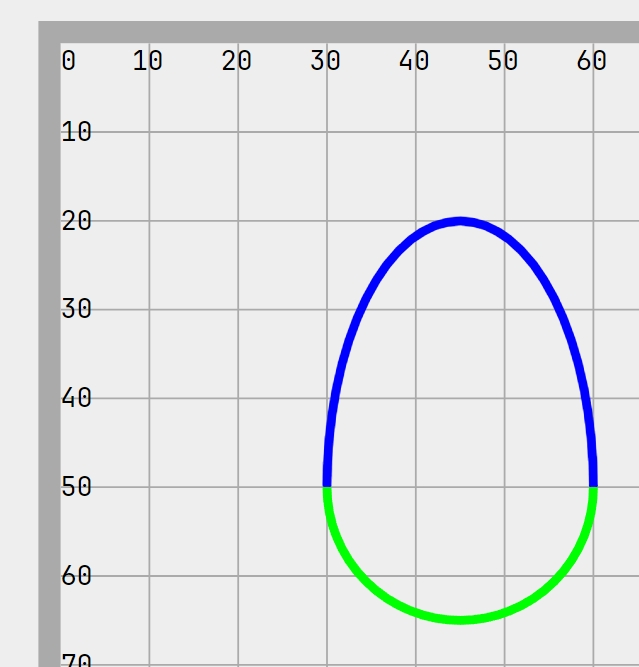
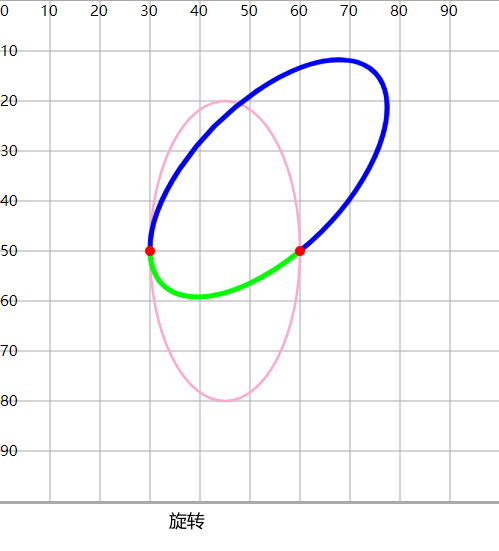

# 弧线

## 概述

+ 圆上两点之间的部分称为圆弧

## 绘制原理

+ 定义两个点和一个圆，这个圆在绘制过程中会自动的经过两个点，从而形成了弧

## 绘制条件

1. 确定两个点(x1,y1)和(x2,y2)
2. 确定圆的半径rx 和 ry （正圆或椭圆），不需要确定圆心，因为上面定义的两个点就可以大约确定圆的位置了

     + 注意1：两点的距离只要<直径，就会产生两个位置的圆（偏上，偏下）
     + 注意2：两个圆会产生4个弧
     + 注意3：有一种特殊情况，就是两个点恰好是直径上的两个端点，就只会形成一个圆，2个弧

3. 确定画弧的方向，顺时针或逆时针方向，每个方向都可能绘制出两个弧
4. 确定绘制弧的大小，大弧或小弧
5. 确定圆的旋转角度。对(椭)圆进行旋转，使得旋转后的圆经过定义的两点，从而形成更特别的弧

     

## 语法

+ A关键字绘制弧线的时候，不能指定起始点坐标。起始点坐标是由之前的绘制决定的(比如M,L)
+ rx ry ： x轴半径和 y 轴半径
+ arc-flag 0表示小弧， 1表示大弧
+ sweep-flag 0表示逆时针， 1表示顺时针
+ x2 y2 终点的坐标

  ```txt
  "A rx(半径) ry(半径) rotate旋转角度 arc-flag弧大小状态(0/1) sweep-flag绘制方向(0/1) x2 y2"
  ```

  ```html
  <path d="M30 50 A15 15 0 0 1 60 50"
      fill="none" stroke="#00f" stroke-width="1" />
  <path d="M30 50 A15 15 0 0 0 60 50"
      fill="none" stroke="#0f0" stroke-width="1" />
  ```

  

  ```html
  <path d="M30 50 A15 30 0 1 1 60 50"
      fill="none" stroke="#fac" stroke-width=".5" />
  <path d="M30 50 A15 30 0 0 0 60 50"
      fill="none" stroke="#fac" stroke-width=".5" />
  <path d="M30 50 A15 30 45 1 1 60 50"
      fill="none" stroke="#00f" stroke-width="1" />
  <path d="M30 50 A15 30 45 0 0 60 50"
      fill="none" stroke="#0f0" stroke-width="1" />

  <circle cx="30" cy="50" r="1" fill="#f00"/>
  <circle cx="60" cy="50" r="1" fill="#f00"/>
  ```

  
