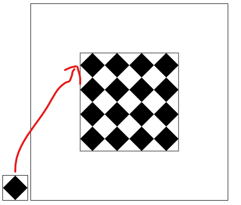

# 图像填充

## 概述

+ 可以将引入图像作为填充背景，也可以是描边背景

+ 图像源可以有多种 ： `img` , `canvas` , `video` , . . .

## ctx.createPattern

+ 使用 `ctx.createPattern(imgSource , repetition)` 方法，创建一个图案对象（CanvasPattern）

  + imgSource 图像源

  + repetition 重复机制

    + `repeat` *默认值*
    + `repeat-x`
    + `repeat-y`
    + `no-repeat`

+ 设置 `ctx.fillStyle = pattern` 填充内容 或 `ctx.strokeStyle = pattern` 轮廓

## 注意

+ 图案平铺的样式，都是基于画布坐标系的原点开始计算的

+ 所以在横向平铺，纵向平铺和不平铺的情况下，有可能画布中央的图形无法显示效果

## 示例

+ 全铺

  ```html
  <canvas class="c1" width="50" height="50"></canvas>
  <canvas class="c2" width="400" height="400"></canvas>
  <script>
    const canvas1 = (function() {
      "use strict";

      /** @type {HTMLCanvasElement} */
      const canvas1 = document.querySelector(".c1");

      /** @type {CanvasRenderingContext2D} */
      const ctx = canvas1.getContext("2d");

      //绘制一个菱形
      ctx.moveTo(0,25) ;
      ctx.lineTo(25,0);
      ctx.lineTo(50,25);
      ctx.lineTo(25,50);
      ctx.closePath();
      ctx.fill();
      return canvas1;
    })();

    const canvas2 = (function() {
      "use strict";

      /** @type {HTMLCanvasElement} */
      const canvas2 = document.querySelector(".c2");

      /** @type {CanvasRenderingContext2D} */
      const ctx = canvas2.getContext("2d");

      const pattern = ctx.createPattern(canvas1, null)
      ctx.fillStyle = pattern ;
      ctx.rect(100,100,200,200);
      ctx.stroke();
      ctx.fill();
    })();
  </script>
  ```

  
