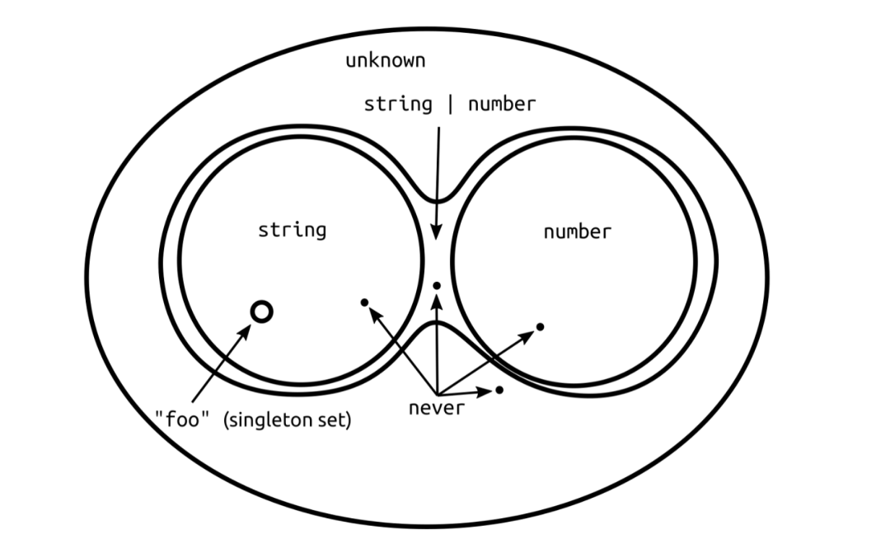

# unknown

## 概述

+ 我们可以使用集合来理解 `never`，`unknown`  是全集，`never` 是最小单元（空集），任意类型都包含了 `never`

+ `unknown` — 表示万物

  

## 基本使用

+ 只有经过“类型缩小”，`unknown` 类型变量才可以使用
+ 所谓“类型缩小”，就是缩小 `unknown` 变量的类型范围(即将一个不确定的类型缩小为更明确的类型)，确保不会出错

  ```js
  let a:unknown = 1;

  // unknown类型的变量a经过typeof运算以后，能够确定实际类型是number，就能用于加法运算了
  if (typeof a === 'number') {
    let r = a + 10; // 正确
  }
  ```

  ```js
  let s:unknown = 'hello';

  if (typeof s === 'string') {
    s.length; // 正确
  }
  ```

+ 在实际工作中，你还可以通过 `instanceof` 或用户自定义类型守卫等方式来缩窄变量的类型

  ```js
  declare function isFunction(x: unknown): x is Function;

  function f20(x: unknown) {
    if (x instanceof Error) {
      x;  // Error
    }
    if (isFunction(x)) {
      x;  // Function
    }
  }
  ```

+ 用类型断言缩小未知范围

  ```js
  const getDogName = () => {
    let x: unknown;
    return x;
  };

  const dogName = getDogName();
  console.log((dogName as string).toLowerCase());
  ```

## 设计的目的

+ 设计的目的是，只有明确 `unknown` 变量的实际类型，才允许使用它，防止像 `any` 那样可以随意乱用，“污染”其他变量
+ 类型缩小以后再使用，就不会报错

