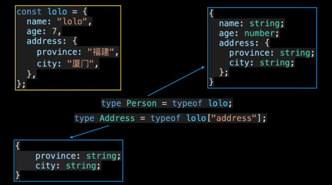
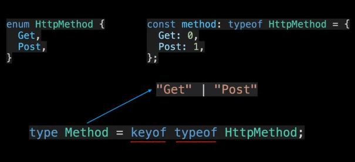

# typeof

## 类型控制流分析

+ Typescript有非常强大的类型推导能力，不单单有之前我们提到的类型拓宽，还可以类型收缩，比如在类型拓宽中，我们就提到了const声明的变量会自动的转变为类型字面量
+ 当然这仅仅是冰山一角，Typescript甚至可以随着你的代码逻辑，不断地尝试窄收窄，这一能力称之为类型的控制流分析（也可以简单的理解为就是类型推导）
+ 有些人也把类型的控制流分析简称为类型收缩(收窄)，但是这种称呼容易和const声明类型的类型收窄引起混淆

  ```js
  function parse(value: number | string | boolean | null | undefined) {
    if (typeof value === "number") {
      return value * 2;       // number
    } else if (typeof value === "string") {
      return `hello ${value}`; // string
    } else if (typeof value === "boolean") {
      return !value;            // boolean
    } else {
      return value;             // null | undefined
    }
  }
  ```

## typeof:类型查询

+ 们使用了在JavaScript很常用的一个操作符typeof，在JavaScript中，我们常常用typeof来检查变量类型，通常会返回`"string"` 、 `"number"` 、 `"boolean"` 、 `"function"` `"object"`等值

在Typescript中给typeof操作符还赋予了新的功能：类型查询（Type Query Operator）

## 类型控制流分析

+ TS中

  + `typeof` 操作符用于获取变量的类型

  + 因此这个操作符的后面接的始终是一个**变量**，且需要运用到类型定义当中

  + 可以将 `JS` 转成 `TS`

    

## 基础类型

+ TypeScript 添加了一个 `typeof` 运算符，您可以在类型上下文中使用它来引用变量或属性的类型

  ```js
  let s = "hello";
  let n: typeof s; // let n: string
  ```

## 对象

+ 对一个对象使用 `typeof`

  ```js
  const lolo = {
    name: "lolo",
    age: 7,
    address: {
      province: "福建",
      city: "厦门",
    },
  };

  type Person = typeof lolo;
  type Address = typeof lolo["address"];
  ```

  

## 类型别名type

+ 代码

  ```js
  type Person = {
    name: string;
    age: number;
  }

  let man: Person = {
    name: "Semlinker",
    age: 30
  }

  type Human = typeof man;
  ```

## 函数

+ 对一个函数使用 `typeof`，获取对应函数类型

  ```js
  function add(a: number, b: number) {
    return a + b;
  }

  type AddType = typeof add; // (a: number, b: number) => number
  type AddReturnType = ReturnType<AddType> // number
  type AddParamsType = Parameters<AddType> // [a: number, b: number]
  ```

+ 可以继续利用 TypeScript 内置的 `ReturnType` 和 `Parameters` 工具类型来分别获取函数的返回值类型和参数类型

  

## 枚举

+ 利用 `keyof` 和 `typeof` 操作符，你就可以获取枚举类型的所有属性名

  ```js
  enum HttpMethod {
    Get,
    Post,
  }

  const method: typeof HttpMethod = {
    Get: 0,
    Post: 1,
  };

  type Method = keyof typeof HttpMethod; // "Get" | "Post"
  ```

  

## 获取数组元素类型

+ 用 `number` 来获取数组元素的类型。结合 `typeof` 可以方便的捕获数组字面量的元素类型

  ```js
  const MyArray = [
    { name: "Alice", age: 15 },
    { name: "Bob", age: 23 },
    { name: "Eve", age: 38 },
  ];

  type Person = typeof MyArray[number];

  // type Person = {
  //    name: string;
  //    age: number;
  // }

  type Age = typeof MyArray[number]["age"];
  // type Age = number

  // Or
  type Age2 = Person["age"];
  // type Age2 = number
  ```

## 搭配const断言

+ 在使用 typeof 操作符的过程中，如果你想要获取更精确的类型，那么你可以结合 TypeScript 3.4 版本中引入的 `const` 断言

  ```js
  let requestMethod = "Get";
  let requestMethod2 = "Get" as const;

  type R0 = typeof requestMethod; // string
  type R1 = typeof requestMethod2; // "Get"
  ```

  ```js
  let user = {
    id: 666,
    name: "阿宝哥",
  };

  let user2 = {
    id: 666,
    name: "阿宝哥",
  } as const;

  // { id: number; name: string; }
  type U0 = typeof user;
  // type U1 = { readonly id: 666; readonly name: "阿宝哥"; }
  type U1 = typeof user2;
  ```

  

## 限制

+ TypeScript 有意的限制了可以使用 `typeof` 的表达式的种类

+ 在 TypeScript 中，只有对**标识符**（比如**变量名**）或者他们的属性使用 `typeof` 才是合法的
