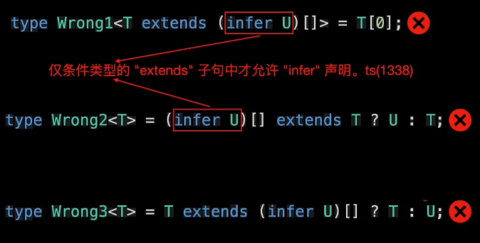

# 推导 infer

## 概述

+ 用于声明类型变量，存储在模式匹配过程中所捕获的类型

## 注意点

+ `infer` 只能在条件类型的 `extends` 子句中使用

+ `infer` 声明的类型变量只能在条件类型的 `true` 分支中使用

+ 错误使用

  

## 示例-获取数组类型中元素的类型

+ 示例

  ```js
  type UnpackedArray<T> = T extends (infer U)[] ? U : T;
  type T0 = string[];
  type U0 = UnpackedArray<T0>; // string
  // 等价于
  type U1 = string; // 可以获取到数组类型 T0 中的元素类型为 string
  ```

+ 执行流程

  

## 示例

+ 获取函数类型的返回值类型

  ```js
  type UnpackedFn<T> = T extends () => infer U ? U : T;

  type T1 = UnpackedFn<() => string> // string;
  type T2 = UnpackedFn<'str'> // 'str'
  ```

+ Promise

  ```js
  type Unpacked<T> = T extends Promise<infer U> ? U : T;
  ```

+ 对象类型

  ```js
  type User = {
    id: number;
    name: string;
  }

  type PropertyType<T> = T extends { id: infer U, name: infer R } ? [U,R] : T;
  type U3 = PropertyType<User>; // [number, string]
  ```
