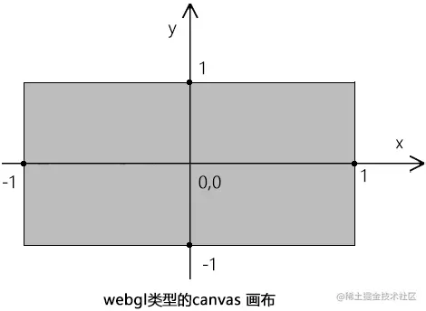

# webgl 坐标系

## 概述

+ webgl画布的建立和获取，和canvas 2d是一样的

+ 一旦我们使用 `canvas.getContext()` 方法获取了webgl 类型的上下文对象，那这张画布就不再是以前的canvas 2d 画布
+ 当然，它也不会变成三维的，因为我们的电脑屏幕始终是平的

+ 那这张画布有什么不一样了呢？它的坐标系变了

+ canvas 2d 画布和 webgl 画布使用的坐标系都是二维直角坐标系，只不过它们坐标原点、y 轴的坐标方向，坐标基底都不一样了

## canvas 2d画布的坐标系

+ canvas 2d 坐标系的原点在左上角

+ canvas 2d 坐标系的 y 轴方向是朝下的

+ canvas 2d 坐标系的坐标基底有两个分量，分别是一个像素的宽和一个像素的高，即1个单位的宽便是1个像素的宽，1个单位的高便是一个像素的高

  

## webgl 的坐标系

+ webgl坐标系的坐标原点在画布中心

+ webgl坐标系的 y 轴方向是朝上的

+ webgl坐标基底中的两个分量分别是半个canvas的宽和canvas的高，即1个单位的宽便是半个canvas的宽，1个单位的高便是半个canvas的高

  

