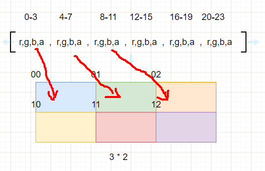

# 图像像素处理

## ImageData

+ 包含了某一个区域内的像素值

+ `imageData.width`

+ `imageData.height`

+ `imageData.data`  `array`  包含区域内所有的像素值 (rgba值)

  + array 是一个一维数组， 每4个位置表示一个像素值

  (x,y)像素的值为

  ```text
  (imageData.width * 4) * y + x * 4 + 0/1/2/3
  ```

  

## ctx.getImageData

+ 使用 `ctx.getImageData(x , y , width , height)` 获得画布中指定区域的 `ImageData` 对象 （像素值）

+ 获得ImageData对象后，就可以通过其获得每一个像素的值，也可以设置每一个像素的值

+ 设置之后*不会默认生效*，还需要重新设置画布的 `ImageData`

+ 使用 `ctx.putImageData(imageData,x,y)` 重新设置画布指定区域的像素值（灰度设置，反色设置等）

## 示例

+ 代码

  ```js
  /** @type {HTMLCanvasElement} */
  const canvas2 = document.querySelector(".c2");

  /** @type {CanvasRenderingContext2D} */
  const ctx = canvas2.getContext("2d");

  const img = new Image();
  img.src = './路飞头像1.png';
  img.onload = () => {
    ctx.drawImage(img, 0, 0);

    const imageData = ctx.getImageData(0, 0, 400, 400);
    console.log(imageData);

    for(let i = 0; i < imageData.data.length; i += 4) {
      const r = imageData.data[i];
      const g = imageData.data[i + 1];
      const b = imageData.data[i + 2];
      const a = imageData.data[i + 3];

      // 灰度
      const avg = (r + g + b) / 3;
      imageData.data[i] = avg;
      imageData.data[i + 1] = avg;
      imageData.data[i + 2] = avg;
    }

    // 重新设置画布
    ctx.putImageData(imageData, 0, 0);
  }
  ```

  
