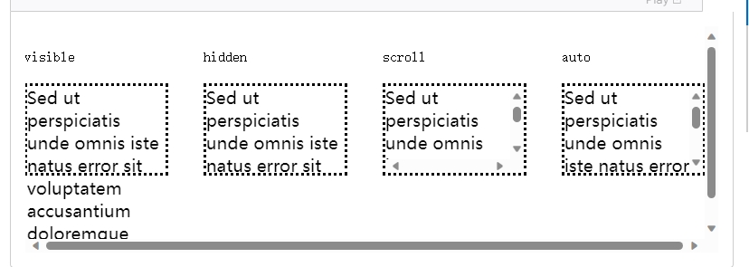

# 滚动条

## 概述

+ 其设置了元素溢出时所需的行为

## 语法

+ 语法

  ```css
  overflow: visible;
  overflow: hidden;
  overflow: clip;
  overflow: scroll;
  overflow: auto;
  overflow: hidden visible;
  ```

  

+ visible

  + 内容不能被裁减并且可能渲染到边距盒（padding）的外部

+ `hidden`

  + 如果需要，内容将被裁减以适应边距（padding）盒
  + 不提供滚动条，也不支持允许用户滚动

+ `clip`

  + 类似于 hidden，内容将以元素的边距（padding）盒进行裁剪

+ `scroll`

  + 如果需要，内容将被裁减以适应边距（padding）盒
  + 无论是否实际裁剪了任何内容，浏览器总是显示滚动条，以防止滚动条在内容改变时出现或者消失
  + 打印机可能会打印溢出的内容

+ `auto`

  + 取决于用户代理。如果内容适应边距（padding）盒，它看起来与 visible 相同，但是仍然建立了一个新的块级格式化上下文
  + 如果内容溢出，则浏览器提供滚动条

+ hidden visible

## 示例

+ 横向滚动条

  ```html
  <div class='wr'>
    <div class='cen'></div>
  </div>
  ```

  ```css
  .wr{
    height: 30px;
    max-width: 100px;
    overflow-x: scroll;
    white-space: nowrap; /* 不换行 */
  }
  ```
