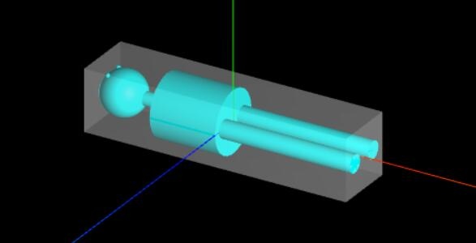

# 包围盒Box3

## 概述

+ 所谓包围盒Box3，就是一个长方体空间，把模型的所有顶点数据包围在一个最小的长方体空间中，这个最小长方体空间就是该模型的包围盒Box3

  

## 定义

+ 包围盒Box3表示三维长方体包围区域，使用min和max两个属性来描述该包围区域，Box3的min和max属性值都是三维向量对象Vector3

+ 描述一个长方体包围盒需要通过xyz坐标来表示，X范围 `[Xmin,Xmax]` ,Y范围 `[Ymin,Ymax]` ,Z范围 `[Zmin,Zmax]` , `.min`属性值是 `Vector3(Xmin, Ymin, Zmin)` ,`.max` 属性值是 `Vector3(Xmax, Ymax, Zmin)`

  ```js
  const box3 = new THREE.Box3()
  console.log('box3',box3);
  box3.min = new THREE.Vector3(-10, -10,0);
  box3.max = new THREE.Vector3(100, 20,50);
  ```

## 计算模型最小包围盒.expandByObject()

+ 模型对象，比如mesh或group，作为 `.expandByObject()` 的参数，可以计算该模型的包围盒

  ```js
  const box3 = new THREE.Box3();
  box3.expandByObject(mesh); // 计算模型包围盒
  console.log('查看包围盒',box3);
  ```

## 包围盒尺寸.getSize()

+ 返回包围盒具体的长宽高尺寸

  ```js
  const scale = new THREE.Vector3()
  // getSize()计算包围盒尺寸
  // 获得包围盒长宽高尺寸，结果保存在参数三维向量对象scale中
  box3.getSize(scale)
  console.log('模型包围盒尺寸', scale);
  ```

## 包围盒几何中心.getCenter()

+ Box3方法 `.getCenter()` 计算返回包围盒几何中心

  ```js
  // 计算包围盒中心坐标
  const center = new THREE.Vector3()
  box3.getCenter(center)
  console.log('模型中心坐标', center);
  ```

## 示例

+ 示例

  ```js
  import * as THREE from "three";

  const geometry = new THREE.BoxGeometry(50, 50, 50);
  const material = new THREE.MeshLambertMaterial({
    color: 0x00ffff,
  });
  const mesh = new THREE.Mesh(geometry, material);
  // 将几何体添加到场景中

  // 包围盒
  (() => {
    const scale = new THREE.Vector3()
    const box3 = new THREE.Box3()
    console.log('box3',box3);

    box3.expandByObject(mesh); // 计算模型包围盒

    box3.getSize(scale)

    console.log('模型包围盒尺寸', scale);
  })();
  ```


