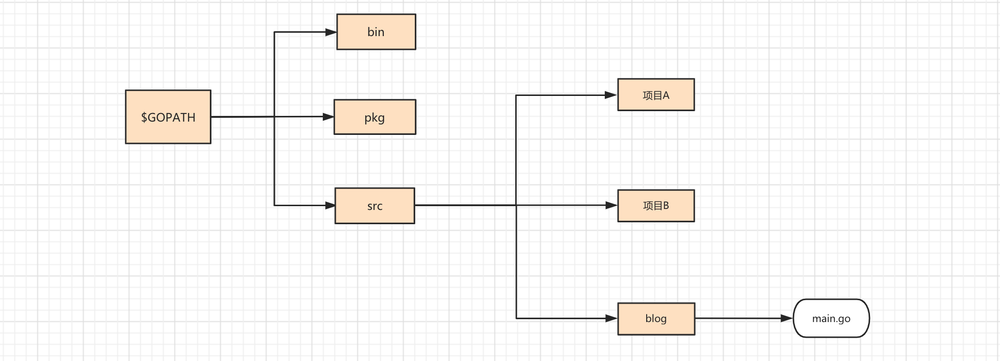

# Go文件

## 概述

+ 项目创建成功之后，如果想要写代码就需要创建一个以 .go 为后缀的文件，在文件中按照Go的语法编写代码。

+ Go 的文件以 .go 为后缀名，这些文件名均由小写字母组成，如 scanner.go 。
+ 如果文件名由多个单词组成，则使用下划线 _ 对它们进行链接，如 scanner_test.go （文件名不包含空格或其他特殊字符）

  

## 代码解释

+ `package main` 每个Go文件顶部都需要定义package 包名称用于表示当前文件所属的包。packge main比较特殊，一旦定义了则被编译后会生成一个可执行文件，而其中的main函数则是程序的入口。
+ `import fmt` 表示导入Go标准库中的一个模块，此模块中有 fmt.Pringln函数用于做输出。
+ `func main(){}` 是一个Go的函数，因文件中定义了package main，所以main函数就是当前程序的入口。

  ```go
  // blog/main.go
  package main
  import "fmt"
  func main() {
      fmt.Println("叫爸爸")
  }
  ```
