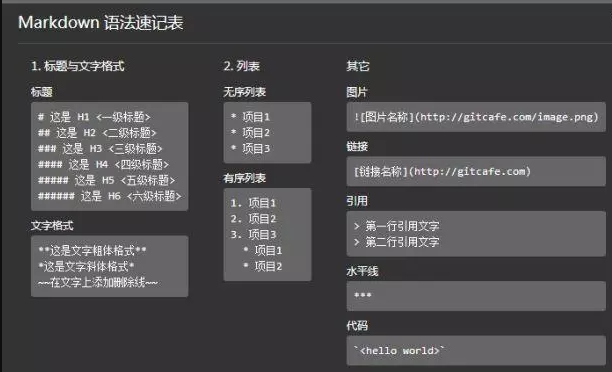

# md语法

## 语法

+ 语法

    

## 目录

+ 语法
    `[TOC]`

## 换行

+ 使用 CSS 的 `<br>` 标签就可以了

## 嵌套区块

```纯文本
> 一级引用
>> 二级引用
>>> 三级引用
>>>> 四级引用
>>>>> 五级引用
>>>>>> 六级引用
```

> 一级引用
> 二级引用
> 三级引用
> 四级引用
> 五级引用
> 六级引用

## 删除线

+ 用 `~~` 把需要显示删除线的字符包裹起来

    ```text
    ~~删除~~
    ```

## 表格

+ 表格的格式不一定要对的非常齐，但是为了良好的变成风格，尽量对齐是最好的

+ 分割线后面的冒号表示对齐方式，写在左边表示左对齐，右边为右对齐，两边都写表示居中

    ```text
    //例子一
    |123|234|345|
    |:-|:-:|-:|
    |abc|bcd|cde|
    |abc|bcd|cde|
    |abc|bcd|cde|
    ```

+ 例子:

    | 123    | 234    | 345   |
    | ------ | ------ | ----- |
    | ab士大夫c | b士大夫cd | 撒旦cde |
    | abc    | bcd    | cde   |
    | abc    | bcd    | cde   |

## 代码diff

+ 示例

    ```diff
    // 数组去重
    const unique = (arr)=>{
    -  return Array.from(new Set(arr))
    +  return [...new Set(arr)]
    }
    ```

## 待办事项

+ [ ] 待完成

+ [x] 已完成

+ [ ] ~~未完成~~

+ 写法

    ```纯文本
    -空格[空格]空格待完成

    -空格[x]空格已完成

    -空格[空格]空格~~未完成~~
    ```

## 图片

+ 引入 ``

    ```markdown
    
    ```

+ 控制宽高

    ```html
    <!-- 因为  转化成 html 后就会变成 img 标签，所以我们直接在 Markdown 中写 img 标签并且加上宽高就可以了 -->
    
    ```

+ 解释

    ```js
    // 原始 markdown 语法
    

    // 转化成 html 后语法
    
    ```
