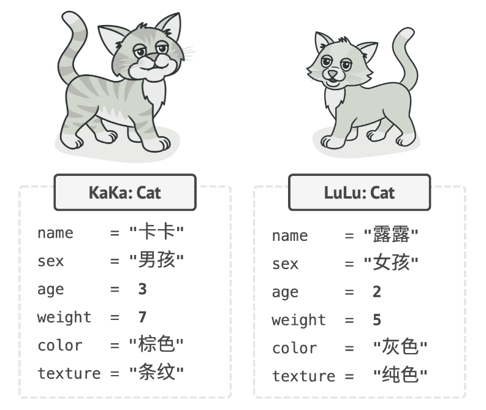

# 类和对象

## 类

+ 所谓类，是针对某一类事物的属性和行为的抽象，经常会把类称之为模板或者蓝图

+ 在描述一个类的时候，我们经常会使用 UML 类图（Unified Modeling Language：统一建模语言），例如：

  

## 对象

+ 所谓对象，就是根据类来创建的具体的实例，所以我们一般称之为实例对象。一个实例对象会拥有类中所定义的属性和方法

  

## JavaScript中的类和对象

+ 在最早期，JavaScript通过函数去模拟类：

  ```js
  // 构造函数
  function Person(name, age){
    this.name = name;
    this.age = age;
  }
  // 有方法的话挂在原型对象上面
  Person.prototype.sayHello = function(){
    console.log("Hello");
  }
  ```

+ 有了 ES6 之后，正式推出了 class 关键字：

  ```js
  class Person {
    constructor(name, age){
      this.name = name;
      this.age = age;
    }
    sayHello(){
      console.log("Hello");
    }
  }
  ```

## TypeScript中类与对象

+ 在 TypeScript 中，多了 public 和 private 来控制成员的可访问性以及相应的类型信息

  ```js
  class Person {
    private name: string;
    private age: number;

    public constructor(name: string, age: number) {
      this.name = name;
      this.age = age;
    }

    public sayHello(){
      console.log("Hello");
    }
  }

  const zhangsan = new Person("张三", 20);
  ```


