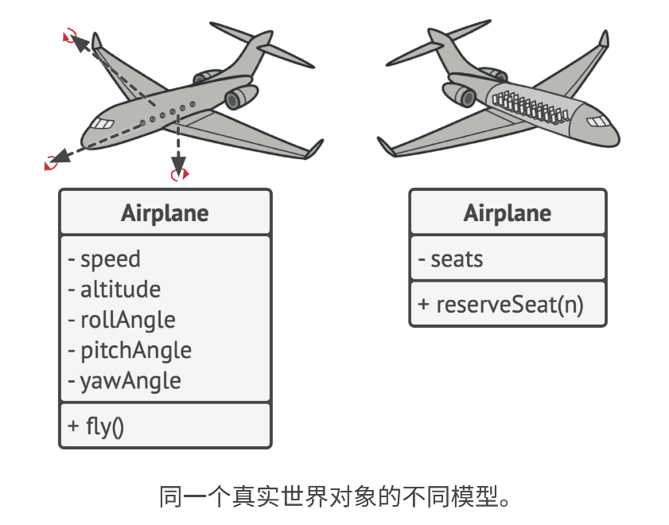

# 抽象

## 概述

+ 抽象是程序设计中非常重要的一种计算思维，和现实生活中抽象的含义有点不同：

  + 现实生活中：含糊、模糊、不清晰
  + 计算机科学：将关键部分从细节中分离出来，忽略不必要的细节，只关注问题的关键方面

+ 因此，在进行面向对象程序设计的时候，针对一个事物，我们只需要关注特定的属性和特定的行为即可，其他不重要的通通忽略掉

+ 遇到不同的需求，哪怕是同一个事物，抽象的程度也是不一样的

  + 飞行模拟器程序
  + 航班预订程序

+ 这两个程序都会涉及到飞机这个事物，针对飞机这个事物，我们会写一个飞机类，但是因为需求不同，我们进行抽象的时候，着力点是不一样的

  

+ 实际上在现实生活中，也有抽象（提取关键点）的概念：

  + 地图：地图是现实世界地理特征的抽象表示，它去除了不必要的细节，仅展示道路、地标、边界等重要信息。

  + 图标和符号：在日常生活中，各种图标和符号（如交通标志、应用程序图标）都是对复杂信息或指令的抽象。

  + 时间表和日程：时间表和日程是时间管理的抽象，它们将时间分割为小时、分钟，并分配给不同的活动或事件。

  + .....
