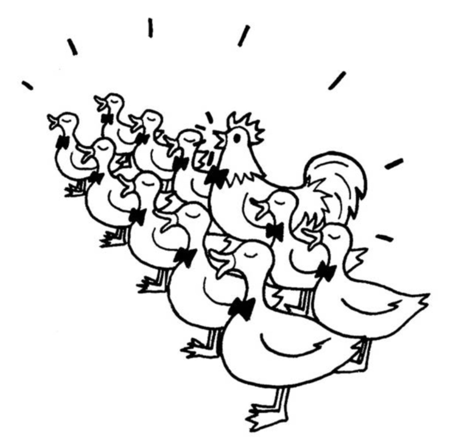

# 多态

## 概述

+ 面向对象编程（OOP）中的多态性（Polymorphism）是指允许不同类的对象对同一消息做出响应的能力，即**同一个接口可以被不同的对象以不同的方式实现**
+ 多态的存在使得对象可以在内部实现细节的不同的情况下共享外部接口

+ 多态分几种类型，最常见的是通过继承实现的子类多态，其中子类需要去重新父类的方法，从而实现相同的接口不同的行为

## JavaScript中的多态

+ 由于 JS 是弱类型语言，因此 JS 被认为天生就是多态的

  ```js
  const dog = {
    name: "doggie",
    age: 3,
    sayHello(){
      console.log("Hello, I'm a dog");
    }
  }

  const cat = {
    name: "mongo",
    age: 3,
    sayHello(){
      console.log("Hello, I'm a cat");
    }
  }

  const obj = {
    sayHello(){}
  }

  function playSound(animal){
    animal.sayHello();
  }

  playSound(dog);
  playSound(cat);
  ```

## JAVA 中的多态

+ 以 Java 为例，因为这样的语言是静态类型语言，存在类型，所以这种语言往往必须子类继承父类，然后改写父类的方法，从而实现继承

  ```js
  class Animal {
    public String name;
    public int age;

    public Animal(String name, int age){
      this.name = name;
      this.age = age;
    }

    public void sayHello{}
  }

  class Dog extends Animal {
    public Dog(String name, int age){
      super(name, age);
    }
    public void sayHello{
      System.out.println("Hello, I'm a dog")
    }
  }

  class Cat extends Animal{
    public Cat(String name, int age){
      super(name, age);
    }
    public void sayHello{
      System.out.println("Hello, I'm a cat")
    }
  }

  public static void playSound(Animal animal){
    animal.sayHello();
  }

  playSound(dog);
  playSound(cat);
  ```

## TypeScript 中的多态

+ TypeScript 虽然有了类型的加持，但是 TypeScript 采用的是鸭子类型（Duck Typing）

+ 什么是鸭子类型？

  + 如果一只鸟走起路来像鸭子，游泳像鸭子，叫起来也像鸭子，那它就可以叫做鸭子。 —— James Whitcomb Riley,1849 - 1916

  + 举个例子，判断一个对象是不是 X 类型，只要检查它是否具有 X 的特定属性或者方法，如果有，即可把它当成 X 类型的对象

  + 我们可以通过一个小故事来更深刻地了解鸭子类型：

  + 从前在 JavaScript 王国里，有一个国王，他觉得世界上最美妙的声音就是鸭子的叫声，于是国王召集大臣，要组建一个 1000 只鸭子组成的合唱团。

  + 大臣们找遍了全国，终于找到 999 只鸭子，但是始终还差一只，最后大臣发现有一只非常特别的鸡，它的叫声跟鸭子一模一样，于是这只鸡就成为了合唱团的最后一员

  + 这个故事告诉我们，国王要听的只是鸭子的叫声，这个声音的主人到底是鸡还是鸭并不重要。鸭子类型指导我们只关注对象的行为，而不关注对象本身

  

+ 只要一个对象的结构和特定的接口相匹配，也就是有相同的属性和方法，那么在 TS 中就会认为该对象实现了这个接口，无论它们的实际类型是否显式声明为该接口类型

  ```js
  class Animal {
    public sayHello(): void {
      console.log("Some animal sound");
    }
  }

  class Dog extends Animal {
    public sayHello(): void {
      console.log("Bark");
    }
  }

  class Cat extends Animal {
    public sayHello(): void {
      console.log("Meow");
    }
  }

  const obj = {
    sayHello() {
      console.log("Hello");
    },
  };

  function playSound(animal: Animal) {
    animal.sayHello();
  }

  const dog = new Dog();
  const cat = new Cat();
  playSound(dog);
  playSound(cat);
  playSound(obj);
  ```
