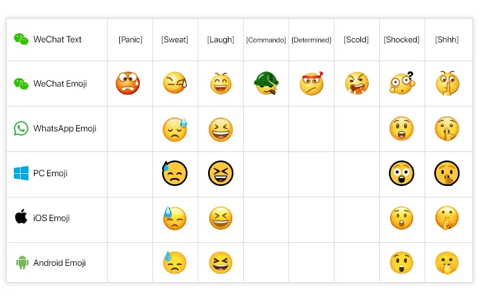

# Emoji 表情

## 概述

+ Emoji 是一种图形符号，最初由日本电信运营商在 1990 年代引入，用于增强短信和网页的表达能力
+ 随着时间的发展，Emoji 已经成为通信中不可或缺的一部分，广泛应用于社交媒体、电子邮件、即时通讯工具等各种平台

+ Emoji 本质上是 Unicode 字符集中的一部分，每个 Emoji 都有一个对应的唯一 Unicode 编码
+ 在最新的 Unicode 16.0 版本中，共指定了 3790 个 Emoji 及其编码

  [Emoji 对应的 Unicode 编码](https://unicode.org/emoji/charts/full-emoji-list.html)

## 不同系统/应用上输入 Emoji

+ 在支持 Unicode 的环境中，如现代的文本编辑器、浏览器等，你可以直接输入 Emoji 字符来使用它们
+ 许多操作系统都提供了便捷的 Emoji 输入方法，例如在 Windows 系统中，按下 win + . 组合键可以打开 Emoji 选择器；在 macOS 系统中，按下 Fn + E 组合键可以打开 Emoji 输入菜单

## 不同系统/应用上显示效果

+ 在不同系统/应用上，Emoji 长的都不太一样，这是为什么呢？
+ 其实，Unicode 为每个 Emoji 分配了唯一的码点，确保其在不同系统中代表相同的含义，但并没有规定每个 Emoji 的样式
+ 因此，每个系统/应用都可以根据各自的设计风格对 Emoji 进行设计，所以就出现了多种风格的 Emoji

  

+ 为了提高一致性，一些项目提供了标准化的 Emoji 集合，可以通过这些项目来自定义 Emoji 显示，如 [Twemoji](https://github.com/googlefonts/noto-emoji)
